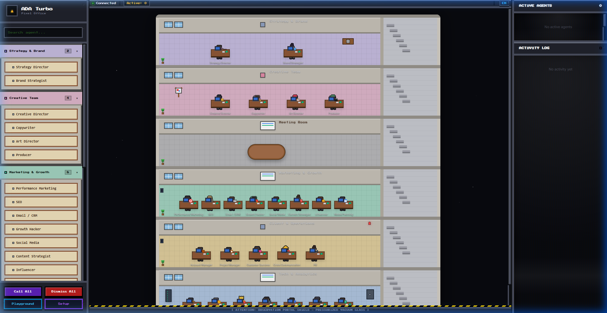
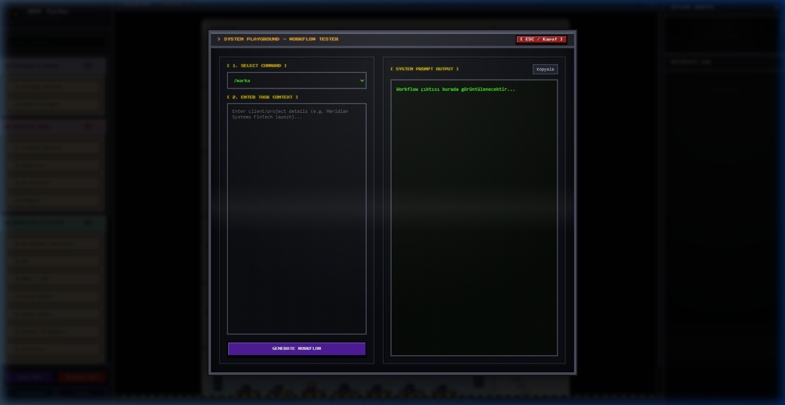
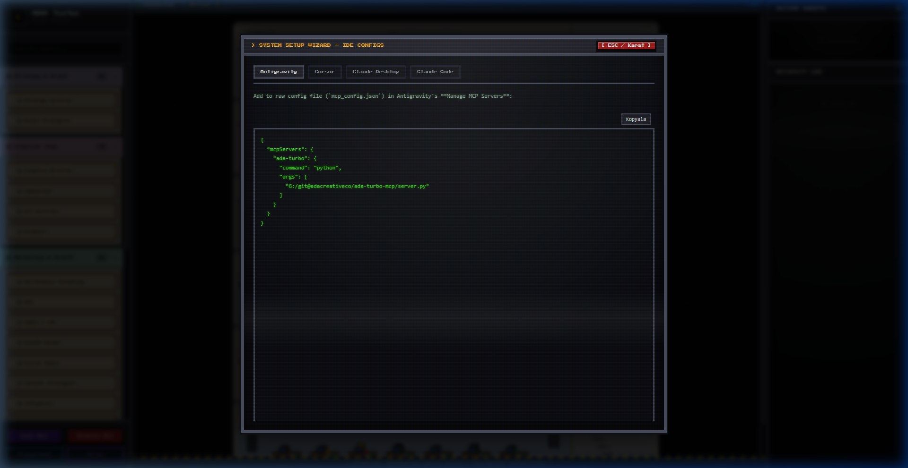

# ADA Turbo — Agency OS & Pixel Office

🇺🇸 English Documentation | 🇹🇷 [Türkçe Dokümantasyon](README.tr.md)

ADA Turbo is a commercial-grade infrastructure that delivers the ADA Creative Co. agency operating system via **MCP (Model Context Protocol)** and an interactive **Pixel Office Visualizer**.
The complete agency structure comprising 20+ roles — strategy, creative, marketing, client relations, analytics, product, and technical — is instantly available in any MCP-compatible client and as a local web simulation.

---

## 🚀 Key Features

- **Dual-Mode Operation:**
  - **MCP Mode (Default):** Runs as an MCP stdio server. Provides backward compatibility with clients like Antigravity, Claude Code, Cursor, and Windsurf. When an agent is called by an IDE, the characters in the browser visually walk to their desks in real-time!
  - **Pixel Office Web Mode:** Starts a local, highly-optimized, retro CRT-effect web interface and office simulation (port `8000`) with zero external dependencies when run with the `--web` flag.
- **Developer Tools (Console Modals):**
  - **Playground (Workflow Tester):** Select commands and input project contexts to dynamically generate workflow instructions, ready to copy and send to an LLM.
  - **Setup Wizard:** Dynamically calculates local absolute paths and outputs ready-to-copy configuration blocks for Cursor, Antigravity, Claude Desktop, and Claude Code.
- **Pixel Characters & Animations:** 26 unique agency characters with idle (breathing, blinking) and walking cycles, moving dynamically across the office floors.

### 🖥️ Pixel Office & Modals Preview

#### 1. Pixel Office Dashboard


#### 2. CRT Workflow Playground


#### 3. CRT Setup Wizard



---

## 🛠️ Installation & Getting Started

### 1. Install Dependencies
```bash
git clone https://github.com/adacreativeco/ada-turbo-mcp.git
cd ada-turbo-mcp
pip install -r requirements.txt
```

### 2. Start the Pixel Office Visualizer
To start the local web interface and visualizer, run:
```bash
python server.py --web
```
Open [http://localhost:8000](http://localhost:8000) in your browser. To run on a different port:
```bash
python server.py --web --port 8080
```

### 3. Run in MCP Mode (Client Integration)
To register the server in an MCP client, use the calculated configurations from the Web Visualizer's Setup Wizard, or copy the configuration snippets below:

#### **Antigravity**
Open your `mcp_config.json` (Windows: `C:\Users\<USER>\.gemini\antigravity\mcp_config.json`, macOS/Linux: `~/.gemini/antigravity/mcp_config.json`) and add:
```json
{
  "mcpServers": {
    "ada-turbo": {
      "command": "python",
      "args": ["/ABSOLUTE/PATH/ada-turbo-mcp/server.py"]
    }
  }
}
```

#### **Cursor**
Add to `~/.cursor/mcp.json` (global) or project-root `.cursor/mcp.json`:
```json
{
  "mcpServers": {
    "ada-turbo": {
      "command": "python",
      "args": ["/ABSOLUTE/PATH/ada-turbo-mcp/server.py"]
    }
  }
}
```

---

## 📂 Architecture

For code quality and maintainability, the codebase is modular:

```
ada-turbo-mcp/
├── server.py                   ← Dual-mode entry point (MCP / Web)
├── index.html                  ← Retro space console Pixel Office UI
├── requirements.txt            ← Project dependencies
├── pyproject.toml              ← Package configuration
├── references/                 ← Domain knowledge base (.md)
├── karakterler/                ← Pixel character graphics and generators
├── animasyonlar/               ← Character walk/idle spritesheets
└── src/                        ← Python modules
    ├── mcp_server.py           ← FastMCP server definitions
    ├── web_server.py           ← Multi-threaded HTTP API server
    ├── workflow_manager.py     ← Command routing, active status logging, mock output
    └── utils.py                ← Helper functions
```

---

## 📝 License

PolyForm Noncommercial License 1.0.0 (Personal/educational use only. Commercial use is strictly prohibited. Contact ADA Creative Co. for commercial licensing.)
