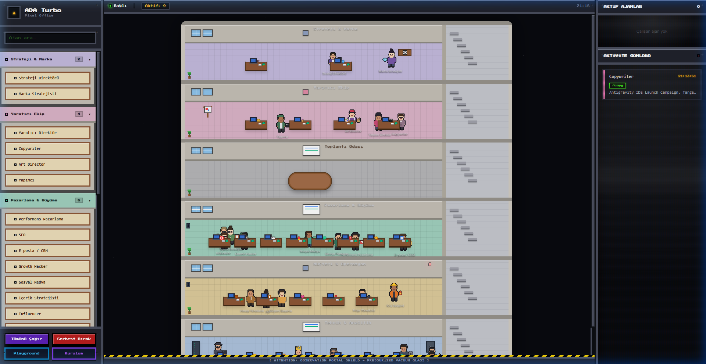
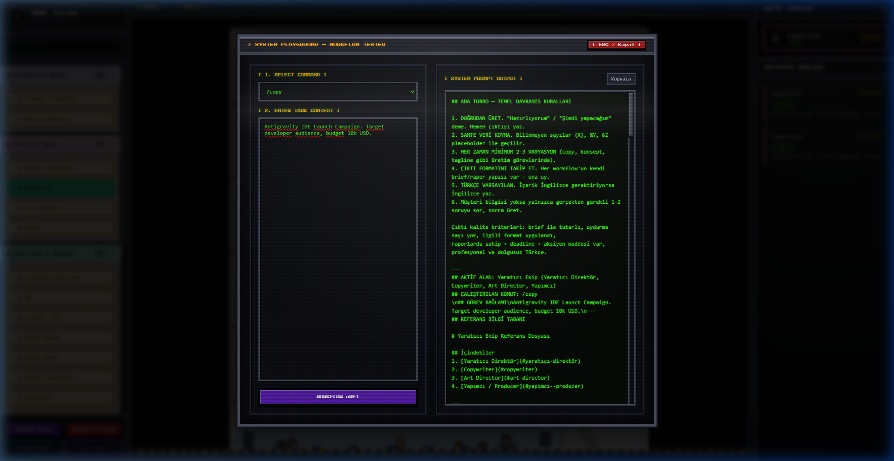
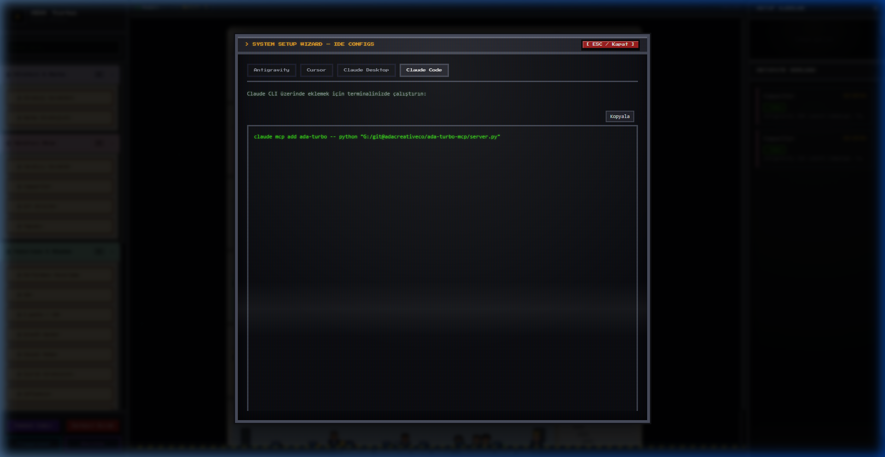

# ADA Turbo — Ajans İşletim Sistemi & Pixel Office

ADA Creative Co. ajans işletim sistemini **MCP (Model Context Protocol)** ve entegre bir **Pixel Office Visualizer** (Piksel Ofis Arayüzü) üzerinden sunan ticari sınıf bir altyapıdır. 
20+ ajanlık tam dijital ajans yapısı — strateji, yaratıcı, pazarlama, müşteri, analitik, ürün, teknik — herhangi bir MCP-uyumlu istemcide ve zengin bir retro web arayüzünde kullanılabilir.

---

## 🚀 Öne Çıkan Özellikler

- **Çift Modlu Çalışma:**
  - **MCP Modu (Varsayılan):** `server.py` doğrudan çalıştırıldığında stdio üzerinden MCP sunucusu olarak başlar. Antigravity, Claude Code, Cursor ve Windsurf gibi tüm popüler istemcilerle geriye dönük tam uyumluluk sunar. Ajanlar çalıştığında web arayüzündeki karakterler gerçek zamanlı olarak odalarına yürür!
  - **Pixel Office Web Modu:** `--web` parametresi ile çalıştırıldığında, 0 harici bağımlılıkla çalışan retro, CRT efektli bir yerel kontrol paneli ve ofis simülasyonu ayağa kaldırır (port `8000`).
- **Geliştirici Araçları (Konsol Modalları):**
  - **Playground (Workflow Test):** Sol panelden açılan modal ile komutları ve proje bağlamlarını test edip LLM'e gidecek promptları anında kopyalayın.
  - **Kurulum Sihirbazı:** Cursor, Antigravity, Claude Desktop ve Claude Code için yerel bilgisayardaki mutlak dosya yollarını otomatik hesaplayarak hazır kopyalanabilir konfigurasyon JSON/terminal kodları üretir.
- **Piksel Karakter ve Animasyonlar:** 26 ajanın kendilerine ait nefes alma, göz kırpma ve yürüme animasyonları ofis katlarında gerçek zamanlı izlenebilir.

### 🖥️ Pixel Office ve Konsol Modalları Önizleme

#### 1. Piksel Ofis Arayüzü


#### 2. CRT Workflow Deneme (Playground)


#### 3. CRT Kurulum Sihirbazı



---

## 🛠️ Kurulum ve Başlangıç

### 1. Bağımlılıkları Kur
```bash
git clone https://github.com/adacreativeco/ada-turbo-mcp.git
cd ada-turbo-mcp
pip install -r requirements.txt
```

### 2. Pixel Office Visualizer'ı Çalıştır (Web Modu)
Yerel web arayüzünü başlatmak için:
```bash
python server.py --web
```
Tarayıcınızda [http://localhost:8000](http://localhost:8000) adresini açın. Farklı bir port kullanmak için:
```bash
python server.py --web --port 8080
```

### 3. MCP Modunda Çalıştır (İstemci Entegrasyonu)
Sunucuyu doğrudan bir MCP istemcisine (örneğin Antigravity veya Cursor) bağlamak için kurulum sihirbazını kullanabilir ya da aşağıdaki config örneklerini ekleyebilirsiniz:

#### **Antigravity**
`mcp_config.json` dosyasına ekleyin (Windows: `C:\Users\<Kullanıcı>\.gemini\antigravity\mcp_config.json`):
```json
{
  "mcpServers": {
    "ada-turbo": {
      "command": "python",
      "args": ["C:/MUTLAK/YOL/ada-turbo-mcp/server.py"]
    }
  }
}
```

#### **Cursor**
Global `~/.cursor/mcp.json` veya proje kökündeki `.cursor/mcp.json` içerisine ekleyin:
```json
{
  "mcpServers": {
    "ada-turbo": {
      "command": "python",
      "args": ["/MUTLAK/YOL/ada-turbo-mcp/server.py"]
    }
  }
}
```

---

## 📂 Proje Mimarisi

Restriksiyonu ve bakımı kolaylaştırmak adına kod tabanı modüler bir yapıya kavuşturulmuştur:

```
ada-turbo-mcp/
├── server.py                   ← Çift modlu giriş noktası (MCP/Web)
├── index.html                  ← Retro space console Pixel Office arayüzü
├── requirements.txt            ← Paket bağımlılıkları
├── pyproject.toml              ← Kurulum ve yapılandırma
├── references/                 ← Uzmanlık alanları bilgi tabanı (.md)
├── karakterler/                ← Piksel karakter görselleri ve generatorlar
├── animasyonlar/               ← Karakterlerin walk/idle sprite şeritleri
└── src/                        ← Python çekirdek modülleri
    ├── mcp_server.py           ← FastMCP sunucu tanımı ve kayıtları
    ├── web_server.py           ← Lightweight HTTP API sunucusu
    ├── workflow_manager.py     ← Komut çözme, loglama, mock output ve referans mantığı
    └── utils.py                ← Yardımcı işlevler
```

---

## 📝 Lisans

PolyForm Noncommercial License 1.0.0 (Kişisel ve eğitim amaçlı kullanım serbesttir, ticari amaçla kullanımı tamamen yasaktır. Ticari lisanslama talepleri için ADA Creative Co. ile iletişime geçiniz.)
